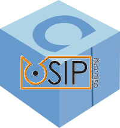

# Conan oSIP

oSIP has been designed to provide the Internet Community a simple way to support the Session Initiation Protocol. SIP is described in the RFC3261

[Conan.io](https://conan.io) package for [oSIP](https://savannah.gnu.org/projects/osip/) project

The packages generated with this **conanfile** can be found in [Bintray](https://bintray.com/uilianries/conan/osip%3Auilianries/5.0.0%3Astable).

## Build packages

Download conan client from [Conan.io](https://conan.io) and run:

    $ python build.py

If your are in Windows you should run it from a VisualStudio console in order to get "mc.exe" in path.

## Upload packages to server

    $ conan upload osip/5.0.0@uilianries/stable --all

## Reuse the packages

### Basic setup

    $ conan install osip/5.0.0@uilianries/stable

### Project setup

If you handle multiple dependencies in your project is better to add a *conanfile.txt*

    [requires]
    osip/5.0.0@uilianries/stable

    [options]
    osip:shared=True # False

    [generators]
    txt
    cmake

Complete the installation of requirements for your project running:</small>

    conan install .

Project setup installs the library (and all his dependencies) and generates the files *conanbuildinfo.txt* and *conanbuildinfo.cmake* with all the paths and variables that you need to link with your dependencies.

### License
[LGPL-2.1](LICENSE)
